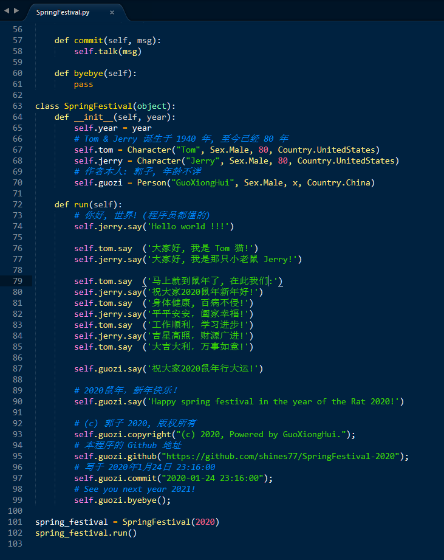

# SpringFestival-2020

## 简介 / Introduction

2020年鼠年春节祝福代码(python)。/ Spring Festival greetings code (python) for 2020 year.

注: 运行环境 `Python 2.7`.

## 代码 / Code

C++：

```python
class SpringFestival(object):
	def __init__(self, year):
		self.year = year
		# Tom & Jerry 诞生于 1940 年, 至今已经 80 年
		self.tom = Character("Tom", Sex.Male, 80, Country.UnitedStates)
		self.jerry = Character("Jerry", Sex.Male, 80, Country.UnitedStates)
		# 作者本人: 郭子, 年龄不详
		self.guozi = Person("GuoXiongHui", Sex.Male, x, Country.China)

	def run(self):
		# 你好, 世界! (程序员都懂的)
		self.jerry.say('Hello world !!!')

		self.tom.say  ('大家好, 我是 Tom 猫!')
		self.jerry.say('大家好, 我是那只小老鼠 Jerry!')

		self.tom.say  ('马上就到鼠年了, 在此我们:')
		self.jerry.say('祝大家2020鼠年新年好!')
		self.tom.say  ('身体健康, 百病不侵!')
		self.jerry.say('平平安安，阖家幸福!')
		self.tom.say  ('工作顺利，学习进步!')
		self.jerry.say('吉星高照，财源广进!')
		self.tom.say  ('大吉大利，万事如意!')

		self.guozi.say('祝大家2020鼠年行大运!')

		# 2020鼠年，新年快乐！
		self.guozi.say('Happy spring festival in the year of the Rat 2020!')

		# (c) 郭子 2020, 版权所有
		self.guozi.copyright("(c) 2020, Powered by GuoXiongHui.");
		# 本程序的 Github 地址
		self.guozi.github("https://github.com/shines77/SpringFestival-2020");
		# 写于 2020年1月24日 23:16:00
		self.guozi.commit("2020-01-24 23:16:00");
		# See you next year 2021!
		self.guozi.byebye();

spring_festival = SpringFestival(2020)
spring_festival.run()
```

## 预览 / Preview


